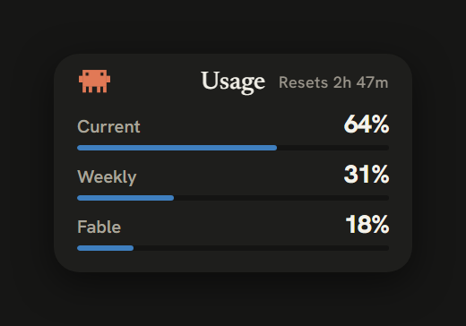
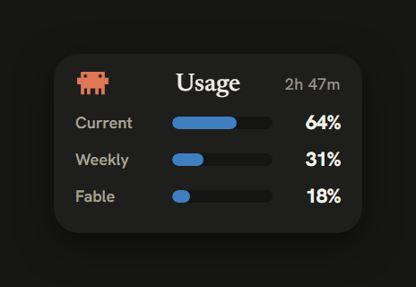
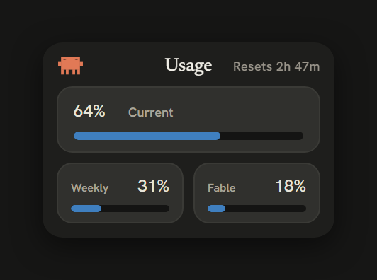
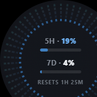
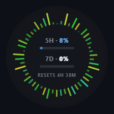
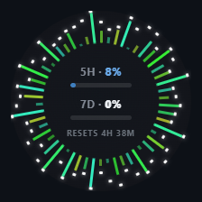

# Clawdometer

Unofficial Windows desktop HUD for Claude Code usage limits.

*Tiếng Việt bên dưới — [xem bản tiếng Việt](#clawdometer-tiếng-việt).*

> **Unofficial.** Not affiliated with or endorsed by Anthropic.

## Skins

Six looks, switchable any time from the tray menu (right-click the tray icon
→ *RICE*). All of them show the same numbers — only the presentation differs.

| Classic | Rowline | Bento Box |
|:---:|:---:|:---:|
|  |  |  |
| Current, Weekly, and Fable each as a label, percentage, and threshold underline under a centered title — the default. | The same three as labelled bars; the most compact card, its labels becoming 5H / 7D / FBL when shrunk. | Current as a hero percentage with its own bar, and Weekly and Fable in their own cells. |

| Audiowave Orb — LED Bloom | Audiowave Orb — Bars | Audiowave Orb — Peak hold |
|:---:|:---:|:---:|
|  |  |  |
| 5-segment LED rungs per bar, colored by usage zone, with kick/snare/hat hits blooming outward across their own bass-to-treble arc. | A ring of 54 spectrum bars around the 5-hour and 7-day percentages. | Same ring, plus peak caps that hang at each bar's high point and fall back down. |

**Classic** is the default — an editorial readout, and what the tray tooltip and
statusline mirror. Current, Weekly, and Fable each show as a label, a
percentage, and a thin threshold underline that turns blue → yellow → red as you
approach a limit.

**Rowline** is the same three as labelled bars — the most compact card. When
shrunk to Compact size its row labels become 5H / 7D / FBL.

**Bento Box** lays the numbers out as self-contained cells instead of a
hierarchy: Current is a hero percentage with its own bar across the top, with
Weekly and Fable in their own cells below. All three card skins carry the clawd
mascot top-left and the 5-hour reset countdown top-right, and none pulse or ring
— the bar/underline color is the only limit cue.

The three **Audiowave Orb** skins are "rice" — the ring reacts to whatever your
speakers are playing. To do that the HUD opens a WASAPI **loopback** capture of
your system audio output while an orb skin is selected (the card skins start no
capture at all). The audio is turned into bar heights inside the process and
then discarded: nothing is recorded, written to disk, or sent anywhere —
consistent with the no-network guarantee below. It also captures only the
system output mix, never a microphone.

## What it does

Claude Code sends usage data (rate-limit percentages, reset times, model,
context window) to your statusline command on every API response. Clawdometer
installs itself as that statusline command (automatically on first HUD launch
if you have no statusline configured), records the latest snapshot to
`~/.clawdometer/state.json`, and shows the 5-hour and 7-day percentages in a
small always-on-top HUD and a system-tray tooltip (`5h X% · 7d Y%`).

When the snapshot goes stale (you're using claude.ai web/mobile or the
desktop app instead of a statusline-fed terminal session), the HUD refreshes
by running the **official CLI headlessly** — `claude -p /usage` — and
parsing the report Claude Code itself prints (about once a minute while no
fresher data is coming in, or on demand via tray → *Refresh usage*).

Those are the only two data sources, and both are official Claude Code
surfaces — Clawdometer makes **zero network requests of its own** and never
touches your credentials. (Earlier versions polled Anthropic's usage
endpoint with Claude Code's OAuth token; that was removed: Anthropic's
Consumer Terms of Service prohibit using OAuth tokens from Claude accounts
in third-party tools, and this app should never put your account at risk.)

The HUD header shows a countdown to the 5-hour window reset (limits are
account-wide, so a model name would add nothing). When a window's reset time
passes while your machine is idle, the HUD derives the truthful 0% locally —
no network needed. The footer shows data age; past 30 minutes it reminds you
that opening Claude Code refreshes the numbers (usage made on claude.ai
web/mobile only shows up on the next Claude Code response).

If you already had a statusline configured, the HUD leaves it alone —
run `clawdometer install` (CLI) to chain it: your original statusline still
renders its output (with a 2-second timeout), and `uninstall` restores it
exactly.

## Security

Clawdometer never asks for, reads, or stores any credential, and makes **no
network requests of any kind** — every binary (hook, CLI, HUD) is compiled
under a `cargo-deny` ban on all HTTP/TLS crates, so this is provable from the
build, not a promise. There is **no telemetry**. Usage data arrives only via
Claude Code's own surfaces: its statusline hook (Claude Code runs the hook
and pipes it a JSON snapshot), and a periodic headless `claude -p /usage`
run whose plain-text output the HUD parses — in both cases Claude Code
itself fetches the numbers with its own sign-in, and the only process
Clawdometer spawns for it is the official `claude` binary. The webview
receives only usage percentages and reset times over
one-way events, runs under a strict CSP, has no invokable backend commands,
and no filesystem or shell capabilities. (The webview also receives a single
`working` boolean for the activity animation, and — only while an Audiowave Orb
[skin](#skins) is selected — a stream of 36 audio spectrum magnitudes for the
ring. The backend derives both locally; neither carries usage data, and the
spectrum bands are bar heights, not audio: nothing is recorded or stored.)

For that activity flag the HUD also **reads** (never writes) Claude Code's
transcript files under `~/.claude/projects/`, to tell when a session is
generating. It inspects only the last message's turn state locally — no network,
nothing leaves the process.

This design is deliberate: Anthropic's Consumer Terms of Service prohibit
using OAuth tokens from Claude Free/Pro/Max accounts in any third-party tool,
so Clawdometer only consumes what Claude Code itself hands to its documented
statusline interface — nothing is impersonated, nothing extra is requested.

**Don't trust — verify.** Everything above is checkable in this repository:

- `cargo deny check bans` proves no HTTP/TLS crate is compiled into any
  binary (config in [`deny.toml`](deny.toml)) — and the source contains no
  network code to begin with (`grep` it: no sockets, no curl, no URLs).
- The webview's entire permission set is
  [`app/src-tauri/capabilities/default.json`](app/src-tauri/capabilities/default.json)
  — events and window-dragging, nothing else.
- Release binaries are **not code-signed**. If you don't want to trust a
  downloaded binary, build from source (below) — it takes one command.
  Only download releases from this repository's official Releases page;
  a binary from anywhere else could be a tampered copy.

**Writes:** only `~/.clawdometer/` and the `statusLine` key of
`~/.claude/settings.json` (during `install`/`uninstall`, or the HUD's
one-time auto-install when no statusline exists — a full backup is taken
first either way). Exception: the tray's "Start with Windows" toggle writes
the standard HKCU Run registry key, only when you click it.

**Two things worth knowing:**

- `clawdometer install` saves a full backup of your `settings.json` to
  `~/.clawdometer/backups/` before touching it. If your settings contain
  secrets (an `env` block with API keys, an `apiKeyHelper` command), those
  are in the backups too — delete `~/.clawdometer/backups/` when you no
  longer need them, or use `uninstall --purge`.
- Avoid running `install`/`uninstall` while a Claude Code session is actively
  changing settings — both edit `settings.json`, and the last writer wins.

## Requirements

- Windows 10 or 11.
- Microsoft Edge WebView2 runtime — preinstalled on Windows 11 and updated
  Windows 10. If missing, the installer downloads it, which needs internet.
- Claude Code installed and signed in — all data comes from its statusline
  hook, so the HUD only updates while Claude Code is in use. (Clawdometer
  honors `%CLAUDE_CONFIG_DIR%` if you've relocated `~/.claude`.)

## Install

### From GitHub Releases

1. Download the installer (`Clawdometer_<version>_x64-setup.exe`) from the
   [latest release](../../releases/latest).
2. Run it. **Windows SmartScreen will warn you** ("Windows protected your
   PC") because the binary is not code-signed — code-signing certificates
   cost money this hobby project doesn't have. Click *More info* → *Run
   anyway*, but only if you downloaded it from this repository's Releases
   page. If that trust step bothers you (it should!), build from source
   instead — see below.
3. Launch **Clawdometer** from the Start menu. A tray icon appears and the
   HUD window shows up. If you have no statusline configured, the HUD sets
   itself up as Claude Code's statusline automatically (one-time, with a
   settings backup) — from then on every Claude Code response updates the
   HUD. Send any message in Claude Code and the percentages appear.

If you already have your own statusline, the HUD won't touch it — use the
CLI (`clawdometer.exe`, from the same release if attached, or built from
source) to chain it: see "Getting started" below.

### From source

Requires Rust (the MSVC toolchain is pinned via `rust-toolchain.toml`) and
[tauri-cli](https://tauri.app):

```
cargo build --release -p clawdometer-cli   # -> target/release/clawdometer.exe (CLI)
cd app/src-tauri && cargo tauri build      # -> HUD app + NSIS installer
```

## Getting started

1. **Run the HUD** (`Clawdometer.exe`). A tray icon appears and the HUD
   window shows up. If Claude Code has no statusline yet, the HUD claims it
   automatically (one-time, settings backed up first) — no CLI step
   required. Use Claude Code and the percentages appear with every response,
   with your statusline showing `[Model] 5h X% · 7d Y%`. Launching the HUD a
   second time just brings the existing one to the front (single instance).
2. **Only if you already have a custom statusline:** run
   `clawdometer install` in a terminal. This chains your original statusline
   (its output still renders) while also feeding the HUD.

## HUD usage

- **Move it:** drag the card anywhere; the position is saved once the drag
  settles and remembered across restarts (and sanity-checked against your
  current monitors, so an unplugged display can't strand it off-screen).
- **Tray icon, left-click:** show/hide the HUD.
- **Tray icon, right-click:** menu with *Show/Hide*, *Refresh usage* (runs a
  headless `claude /usage` now), *RICE*, *Compact size*, *Opacity*, *Start with
  Windows* (check mark reflects the actual HKCU Run key state), and *Quit*.
- **RICE:** picks the skin — *Classic*, *Rowline*, *Bento Box*, or *Audiowave
  Orb* → *Bars* / *Peak hold* / *LED Bloom* (see [Skins](#skins)). One radio group, so exactly
  one is ever checked. Switching resizes the HUD (the orb is a 160×160 square;
  each card skin has its own size) and is remembered across restarts. Selecting
  an orb skin starts the system-audio loopback capture; going back to a card
  skin stops it.
- **Compact size:** shrinks the card to roughly half width (the same numbers,
  with 5H / 7D / FBL row labels on Rowline). Also toggled by
  double-clicking the card. Remembered across restarts.
- **Opacity:** 100/85/70/55% — makes the always-on-top card less visually
  blocking. Also available by right-clicking the card. Remembered across
  restarts.
- **Activity animation:** the clawd mascot runs a little "working" animation — a
  gentle bob with its eyes scanning left to right — while any Claude Code session
  is generating, and rests when everything is idle. Unlike the usage numbers,
  this doesn't depend on the statusline hook (so it works even in GUI clients
  that don't run it): the HUD reads the turn state from Claude Code's transcript
  files under `~/.claude/projects/` — locally, no network — and stays lit through
  long "thinking" pauses, stopping the moment a turn completes. Respects
  `prefers-reduced-motion` (the mascot holds still, no motion).
- **Footer:** data age ("as of 1m ago"). Data only arrives while Claude Code
  is in use, so aging is normal; past 30 minutes the footer turns red with
  "open Claude Code to refresh" — a reminder, not an error. When a limit
  window's reset time passes, the HUD shows 0% for it on its own (derived
  locally, no network). Before any data ever arrives, the card and the tray
  tooltip say "waiting for data — open Claude Code".

## CLI

```
clawdometer install      # backs up settings.json, sets/wraps statusLine
clawdometer status       # print the latest snapshot + capture time
clawdometer uninstall    # restores the original statusLine (or removes the key)
clawdometer uninstall --purge   # also deletes ~/.clawdometer/
```

- `install` writes a timestamped backup of your `settings.json` to
  `~/.clawdometer/backups/` before touching anything, and never overwrites
  an existing backup.
- `install` is idempotent; re-running after moving the binary updates the
  stale path in place.
- If you edited `statusLine` yourself after installing, `uninstall` refuses
  to touch it and tells you where your original is preserved.
- `--settings <path>` (for `install`/`uninstall`) targets a non-default
  settings.json — mainly for testing.
- **Complete removal:** run `clawdometer uninstall --purge`, then uninstall
  the HUD app from Windows *Apps & features* — its uninstaller also removes
  the "Start with Windows" autostart entry. If you run a portable or
  from-source build (no installer), toggle *Start with Windows* off in the
  tray menu **before** deleting the binary; otherwise the HKCU Run registry
  value it created is left pointing at a deleted exe.

## Files

Everything lives in `~/.clawdometer/`:

| File | Purpose |
|------|---------|
| `state.json` | last statusline snapshot (written by the hook) |
| `live.json` | last refresh snapshot (written by the HUD after a headless `claude /usage` run) |
| `wrapped.json` | your original statusline command, chained + restored on uninstall |
| `ui.json` | HUD window position, opacity, compact mode |
| `statusline-autoinstall.done` | marker: the HUD offered to claim a free statusLine once (so removing it later sticks) |
| `backups/` | timestamped copies of settings.json taken before each install (may contain secrets from your settings — see Security) |

## Building from source

See "Install → From source" above. Additionally:

```
cargo test --workspace     # full test suite
cargo deny check bans      # verify the no-network-crates invariant
```

## Notes

- Percentages have 1% granularity — the same as `/usage` inside Claude Code.
- Data updates with every Claude Code response; when that goes quiet the HUD
  refreshes via a headless `claude /usage` about once a minute, so usage
  made on claude.ai web/mobile still shows up. It also zeroes a window
  locally once its reset time passes.
- Clawdometer's own binaries are fully offline: proxies, VPNs, and firewalls
  only matter to Claude Code itself.

## License

MIT

---

# Clawdometer (Tiếng Việt)

HUD không chính thức cho Windows, hiển thị giới hạn sử dụng của Claude Code.

> **Không chính thức.** Không liên kết với và không được Anthropic bảo trợ.

## Giao diện (Skins)

Sáu kiểu hiển thị, đổi lúc nào cũng được từ menu khay (chuột phải vào biểu
tượng khay → *RICE*). Cả sáu đều hiện cùng một dữ liệu — chỉ khác cách trình bày.

| Classic | Rowline | Bento Box |
|:---:|:---:|:---:|
|  |  |  |
| Mỗi mục Current, Weekly, Fable là một nhãn, phần trăm, và gạch chân theo ngưỡng dưới tiêu đề căn giữa — giao diện mặc định. | Cùng ba mục đó dưới dạng thanh có nhãn; thẻ gọn nhất, nhãn thành 5H / 7D / FBL khi thu nhỏ. | Current là phần trăm chính kèm thanh riêng, Weekly và Fable trong ô riêng. |

| Audiowave Orb — LED Bloom | Audiowave Orb — Bars | Audiowave Orb — Peak hold |
|:---:|:---:|:---:|
|  |  |  |
| Mỗi thanh là 5 đoạn LED, đổi màu theo ngưỡng sử dụng, nở rộng theo từng cú đánh bass/snare/hat trong cung riêng của nó. | Vòng 54 thanh phổ bao quanh phần trăm 5 giờ và 7 ngày. | Cùng vòng đó, thêm chóp đỉnh treo ở mức cao nhất của mỗi thanh rồi rơi dần xuống. |

**Classic** là giao diện mặc định — kiểu đọc số editorial, cũng là thứ mà
tooltip khay và statusline phản chiếu. Current, Weekly, và Fable mỗi mục hiện
một nhãn, một phần trăm, và một gạch chân mảnh đổi xanh dương → vàng → đỏ khi bạn
tiến gần giới hạn.

**Rowline** là cùng ba mục đó dưới dạng thanh có nhãn — thẻ gọn nhất. Khi thu về
Compact, nhãn hàng thành 5H / 7D / FBL.

**Bento Box** trình bày các con số thành các ô độc lập thay vì một hệ thống phân
cấp: Current là phần trăm chính kèm thanh riêng trải ngang trên cùng, còn Weekly
và Fable nằm trong ô riêng bên dưới. Cả ba giao diện thẻ đều đặt linh vật clawd ở
góc trên trái và đếm ngược reset của cửa sổ 5 giờ ở góc trên phải, và không cái
nào nhấp nháy hay viền — màu thanh/gạch chân là tín hiệu giới hạn duy nhất.

Ba giao diện **Audiowave Orb** là "rice" — vòng phổ phản ứng theo bất cứ thứ
gì loa của bạn đang phát. Để làm vậy, HUD mở một luồng thu **loopback** WASAPI
từ đầu ra âm thanh hệ thống trong lúc giao diện orb được chọn (các giao diện thẻ
không mở luồng thu nào). Âm thanh được chuyển thành chiều cao các thanh ngay trong tiến
trình rồi bỏ đi: không ghi lại, không lưu ra đĩa, không gửi đi đâu — đúng với
cam kết không-mạng bên dưới. Nó cũng chỉ thu bản trộn đầu ra của hệ thống,
không bao giờ thu micro.

## Ứng dụng làm gì

Claude Code gửi dữ liệu sử dụng (phần trăm giới hạn, thời điểm reset, model,
context window) tới lệnh statusline của bạn sau mỗi phản hồi API. Clawdometer
tự cài mình làm lệnh statusline đó (tự động ở lần chạy HUD đầu tiên nếu bạn
chưa cấu hình statusline nào), ghi ảnh chụp mới nhất vào
`~/.clawdometer/state.json`, và hiển thị phần trăm 5 giờ / 7 ngày trong một
cửa sổ HUD nhỏ luôn nổi trên cùng cùng tooltip ở khay hệ thống
(`5h X% · 7d Y%`).

Khi ảnh chụp bị cũ (bạn đang dùng claude.ai web/mobile hoặc desktop app thay
vì phiên terminal có statusline), HUD tự làm mới bằng cách chạy **CLI chính
thức ở chế độ headless** — `claude -p /usage` — và parse báo cáo mà chính
Claude Code in ra (khoảng mỗi phút một lần khi không có dữ liệu mới hơn,
hoặc theo yêu cầu qua menu khay → *Refresh usage*).

Đó là hai nguồn dữ liệu duy nhất, và cả hai đều là bề mặt chính thức của
Claude Code — Clawdometer **không tự thực hiện request mạng nào** và không
bao giờ động vào thông tin đăng nhập của bạn. (Các phiên bản trước truy vấn
endpoint usage của Anthropic bằng OAuth token của Claude Code; tính năng đó
đã bị gỡ bỏ: Điều khoản Dịch vụ Người dùng của Anthropic cấm dùng OAuth
token của tài khoản Claude trong công cụ bên thứ ba, và app này không được
phép đặt tài khoản của bạn vào rủi ro.)

Phần đầu HUD hiển thị đếm ngược tới lúc reset cửa sổ 5 giờ. Khi thời điểm
reset của một cửa sổ trôi qua trong lúc máy rảnh, HUD tự suy ra con số trung
thực 0% ngay tại chỗ — không cần mạng. Phần chân hiển thị tuổi dữ liệu; quá
30 phút nó nhắc bạn mở Claude Code để làm mới (mức sử dụng phát sinh trên
claude.ai web/mobile chỉ hiện ra ở phản hồi Claude Code kế tiếp).

Nếu bạn đã có statusline cấu hình sẵn, HUD sẽ không động vào — hãy chạy
`clawdometer install` (CLI) để nối chuỗi: statusline gốc vẫn hiển thị output
của mình (với timeout 2 giây), và `uninstall` khôi phục lại chính xác.

## Bảo mật

Clawdometer không bao giờ yêu cầu, đọc, hay lưu trữ bất kỳ thông tin đăng
nhập nào, và thực hiện **zero request mạng dưới mọi hình thức** — mọi binary
(hook, CLI, HUD) đều được biên dịch với lệnh cấm (qua `cargo-deny`) toàn bộ
crate HTTP/TLS, nên điều này chứng minh được từ chính bản build, không phải
lời hứa. **Hoàn toàn không có telemetry.** Dữ liệu sử dụng chỉ đến qua các
bề mặt của chính Claude Code: hook statusline (Claude Code chạy hook và
truyền cho nó một ảnh chụp JSON), và lần chạy `claude -p /usage` headless
định kỳ mà HUD parse output dạng text — trong cả hai trường hợp, chính
Claude Code lấy số liệu bằng đăng nhập của nó, và tiến trình duy nhất
Clawdometer khởi chạy cho việc này là binary `claude` chính thức. Webview
chỉ nhận phần trăm sử dụng và thời điểm reset qua sự kiện một chiều,
chạy dưới CSP nghiêm ngặt, không có lệnh backend nào gọi được từ giao diện,
và không có quyền truy cập file hay shell. (Webview cũng nhận một biến boolean
`working` cho hiệu ứng hoạt động, và — chỉ khi một [giao diện](#giao-diện-skins)
Audiowave Orb đang được chọn — một luồng 36 giá trị độ lớn phổ âm thanh cho
vòng orb. Backend suy ra cả hai tại chỗ; không cái nào mang dữ liệu sử dụng, và
các dải phổ là chiều cao thanh chứ không phải âm thanh: không có gì được ghi
lại hay lưu trữ.)

Cho cờ hoạt động đó, HUD còn **đọc** (không bao giờ ghi) các file transcript
của Claude Code trong `~/.claude/projects/`, để biết khi nào một phiên đang tạo
phản hồi. Nó chỉ xem trạng thái lượt của tin nhắn cuối tại chỗ — không mạng,
không gì rời khỏi tiến trình.

Thiết kế này là chủ đích: Điều khoản Dịch vụ Người dùng của Anthropic cấm
dùng OAuth token của tài khoản Claude Free/Pro/Max trong bất kỳ công cụ bên
thứ ba nào, nên Clawdometer chỉ tiêu thụ những gì Claude Code tự trao cho
giao diện statusline được tài liệu hóa của nó — không giả danh gì, không
request thêm gì.

**Đừng tin — hãy kiểm chứng.** Mọi điều ở trên đều kiểm tra được ngay trong
repository này:

- `cargo deny check bans` chứng minh không crate HTTP/TLS nào được biên dịch
  vào bất kỳ binary nào (cấu hình trong [`deny.toml`](deny.toml)) — và mã
  nguồn vốn không chứa dòng code mạng nào (`grep` thử: không socket, không
  curl, không URL).
- Toàn bộ quyền của webview nằm trong
  [`app/src-tauri/capabilities/default.json`](app/src-tauri/capabilities/default.json)
  — chỉ sự kiện và kéo cửa sổ, không gì khác.
- Binary phát hành **không được ký số (code-signed)**. Nếu bạn không muốn
  tin một binary tải về, hãy tự biên dịch từ mã nguồn (bên dưới) — chỉ một
  lệnh. Chỉ tải release từ trang Releases chính thức của repository này;
  binary từ bất kỳ nơi nào khác có thể là bản đã bị can thiệp.

**Ghi dữ liệu:** chỉ vào `~/.clawdometer/` và khóa `statusLine` trong
`~/.claude/settings.json` (khi `install`/`uninstall`, hoặc khi HUD tự cài
một-lần-duy-nhất lúc chưa có statusline nào — cả hai đều sao lưu toàn bộ
settings trước). Ngoại lệ: nút "Start with Windows" trong menu khay ghi khóa
registry HKCU Run tiêu chuẩn, chỉ khi bạn bấm vào.

**Hai điều nên biết:**

- `clawdometer install` sao lưu toàn bộ `settings.json` vào
  `~/.clawdometer/backups/` trước khi chỉnh sửa. Nếu settings của bạn chứa
  bí mật (khối `env` có API key, lệnh `apiKeyHelper`), chúng cũng nằm trong
  bản sao lưu — hãy xóa `~/.clawdometer/backups/` khi không cần nữa, hoặc
  dùng `uninstall --purge`.
- Tránh chạy `install`/`uninstall` khi một phiên Claude Code đang chủ động
  thay đổi settings — cả hai đều sửa `settings.json`, và bên ghi sau cùng
  sẽ thắng.

## Yêu cầu

- Windows 10 hoặc 11.
- Microsoft Edge WebView2 runtime — có sẵn trên Windows 11 và Windows 10 đã
  cập nhật. Nếu thiếu, trình cài đặt sẽ tải về, việc này cần internet.
- Đã cài và đăng nhập Claude Code — toàn bộ dữ liệu đến từ hook statusline
  của nó, nên HUD chỉ cập nhật khi Claude Code đang được dùng. (Clawdometer
  tôn trọng `%CLAUDE_CONFIG_DIR%` nếu bạn đã di dời `~/.claude`.)

## Cài đặt

### Từ GitHub Releases

1. Tải bộ cài (`Clawdometer_<version>_x64-setup.exe`) từ
   [release mới nhất](../../releases/latest).
2. Chạy nó. **Windows SmartScreen sẽ cảnh báo** ("Windows protected your
   PC") vì binary chưa được ký số — chứng chỉ code-signing tốn tiền mà dự án
   sở thích này không có. Bấm *More info* → *Run anyway*, nhưng chỉ khi bạn
   tải từ trang Releases của chính repository này. Nếu bước tin tưởng đó làm
   bạn lấn cấn (và nên thế!), hãy tự biên dịch từ mã nguồn — xem bên dưới.
3. Mở **Clawdometer** từ Start menu. Biểu tượng khay xuất hiện cùng cửa sổ
   HUD. Nếu bạn chưa cấu hình statusline nào, HUD tự đặt mình làm statusline
   của Claude Code (một lần duy nhất, có sao lưu settings) — từ đó mỗi phản
   hồi của Claude Code đều cập nhật HUD. Gửi bất kỳ tin nhắn nào trong
   Claude Code là phần trăm hiện ra.

Nếu bạn đã có statusline riêng, HUD sẽ không động vào — hãy dùng CLI
(`clawdometer.exe`, tải từ cùng release nếu có đính kèm hoặc tự biên dịch)
để nối chuỗi: xem mục "Bắt đầu" bên dưới.

### Từ mã nguồn

Cần Rust (toolchain MSVC, ghim qua `rust-toolchain.toml`) và
[tauri-cli](https://tauri.app):

```
cargo build --release -p clawdometer-cli   # -> target/release/clawdometer.exe (CLI)
cd app/src-tauri && cargo tauri build      # -> ứng dụng HUD + bộ cài NSIS
```

## Bắt đầu

1. **Chạy HUD** (`Clawdometer.exe`). Biểu tượng khay xuất hiện cùng cửa sổ
   HUD. Nếu Claude Code chưa có statusline, HUD tự nhận vị trí đó (một lần
   duy nhất, sao lưu settings trước) — không cần bước CLI nào. Dùng Claude
   Code là phần trăm hiện ra theo từng phản hồi, statusline hiển thị
   `[Model] 5h X% · 7d Y%`. Chạy HUD lần thứ hai chỉ đưa HUD hiện có lên
   trước (một phiên bản duy nhất).
2. **Chỉ khi bạn đã có statusline riêng:** chạy `clawdometer install` trong
   terminal. Lệnh này nối chuỗi statusline gốc của bạn (output của nó vẫn
   hiển thị) đồng thời cấp dữ liệu cho HUD.

## Sử dụng HUD

- **Di chuyển:** kéo thẻ tới bất kỳ đâu; vị trí được lưu khi thao tác kéo
  dừng lại và được nhớ qua các lần khởi động (có kiểm tra với các màn hình
  hiện tại, nên màn hình đã rút không thể làm HUD kẹt ngoài vùng nhìn thấy).
- **Biểu tượng khay, chuột trái:** ẩn/hiện HUD.
- **Biểu tượng khay, chuột phải:** menu gồm *Show/Hide*, *Refresh usage*
  (chạy `claude /usage` headless ngay lập tức), *RICE*, *Compact size*,
  *Opacity*, *Start with Windows* (dấu tích phản ánh đúng trạng thái khóa
  HKCU Run hiện tại), và *Quit*.
- **RICE:** chọn giao diện — *Classic*, *Rowline*, *Bento Box*, hoặc *Audiowave
  Orb* → *Bars* / *Peak hold* / *LED Bloom* (xem [Giao diện](#giao-diện-skins)). Cả sáu là một
  nhóm radio, nên luôn chỉ đúng một cái được tích. Đổi giao diện sẽ đổi kích
  thước HUD (orb là ô vuông 160×160; mỗi giao diện thẻ có kích thước riêng) và
  được nhớ qua các lần khởi động. Chọn giao diện orb sẽ bật luồng thu loopback âm
  thanh hệ thống; quay lại một giao diện thẻ sẽ tắt nó.
- **Compact size:** thu thẻ còn khoảng nửa chiều rộng (vẫn các con số đó, với
  nhãn hàng 5H / 7D / FBL trên Rowline). Cũng bật/tắt được bằng cách
  nhấp đúp vào thẻ. Được nhớ qua các lần khởi động.
- **Opacity:** 100/85/70/55% — giúp thẻ luôn-nổi-trên-cùng bớt che khuất.
  Cũng mở được bằng chuột phải vào thẻ. Được nhớ qua các lần khởi động.
- **Hiệu ứng hoạt động:** linh vật clawd chạy một hiệu ứng "đang làm việc" nhỏ —
  khẽ nhún người với đôi mắt quét trái sang phải — khi bất kỳ phiên Claude Code
  nào đang tạo phản hồi, và nghỉ khi mọi thứ rảnh. Khác với các con số sử dụng,
  hiệu ứng này không phụ thuộc hook statusline (nên chạy được cả trên client GUI
  không gọi hook): HUD đọc trạng thái lượt (turn) từ các file transcript của
  Claude Code trong `~/.claude/projects/` — tại chỗ, không mạng — và vẫn sáng
  suốt các quãng "suy nghĩ" dài, dừng ngay khi một lượt kết thúc. Tôn trọng
  `prefers-reduced-motion` (linh vật đứng yên, không chuyển động).
- **Chân HUD:** tuổi dữ liệu ("as of 1m ago"). Dữ liệu chỉ đến khi Claude
  Code đang được dùng, nên dữ liệu cũ dần là bình thường; quá 30 phút phần
  chân chuyển đỏ với "open Claude Code to refresh" — một lời nhắc, không
  phải lỗi. Khi thời điểm reset của một cửa sổ giới hạn trôi qua, HUD tự
  hiển thị 0% cho nó (suy ra tại chỗ, không cần mạng). Trước khi có dữ liệu
  lần đầu, thẻ và tooltip khay hiển thị "waiting for data — open Claude
  Code".

## CLI

```
clawdometer install      # sao lưu settings.json, đặt/nối chuỗi statusLine
clawdometer status       # in ảnh chụp mới nhất + thời điểm ghi nhận
clawdometer uninstall    # khôi phục statusLine gốc (hoặc xóa khóa)
clawdometer uninstall --purge   # đồng thời xóa ~/.clawdometer/
```

- `install` ghi bản sao lưu có dấu thời gian của `settings.json` vào
  `~/.clawdometer/backups/` trước khi động vào bất cứ thứ gì, và không bao
  giờ ghi đè bản sao lưu đã có.
- `install` chạy lại vô hại; chạy lại sau khi di chuyển binary sẽ cập nhật
  đường dẫn cũ tại chỗ.
- Nếu bạn tự sửa `statusLine` sau khi cài, `uninstall` sẽ từ chối động vào
  và cho biết bản gốc được lưu ở đâu.
- `--settings <path>` (cho `install`/`uninstall`) nhắm tới settings.json
  không mặc định — chủ yếu để kiểm thử.
- **Gỡ bỏ hoàn toàn:** chạy `clawdometer uninstall --purge`, rồi gỡ app HUD
  trong *Apps & features* của Windows — trình gỡ cài đặt cũng xóa mục tự
  khởi động "Start with Windows". Nếu bạn dùng bản portable hoặc tự build
  (không qua installer), hãy tắt *Start with Windows* trong menu khay
  **trước khi** xóa binary; nếu không, giá trị registry HKCU Run mà nó tạo
  sẽ trỏ tới một exe đã bị xóa.

## Các file

Mọi thứ nằm trong `~/.clawdometer/`:

| File | Mục đích |
|------|----------|
| `state.json` | ảnh chụp statusline mới nhất (do hook ghi) |
| `live.json` | ảnh chụp refresh mới nhất (HUD ghi sau mỗi lần chạy `claude /usage` headless) |
| `wrapped.json` | lệnh statusline gốc của bạn, được nối chuỗi + khôi phục khi gỡ |
| `ui.json` | vị trí cửa sổ HUD, độ mờ, chế độ compact |
| `statusline-autoinstall.done` | đánh dấu: HUD đã đề nghị nhận khóa statusLine trống một lần (nên gỡ ra sau đó sẽ được tôn trọng) |
| `backups/` | bản sao settings.json có dấu thời gian trước mỗi lần cài (có thể chứa bí mật từ settings — xem mục Bảo mật) |

## Biên dịch từ mã nguồn

Xem "Cài đặt → Từ mã nguồn" ở trên. Ngoài ra:

```
cargo test --workspace     # toàn bộ bộ kiểm thử
cargo deny check bans      # kiểm chứng lệnh cấm crate mạng
```

## Ghi chú

- Phần trăm có độ chi tiết 1% — giống `/usage` bên trong Claude Code.
- Dữ liệu cập nhật theo từng phản hồi của Claude Code; khi im ắng, HUD tự
  làm mới qua `claude /usage` headless khoảng mỗi phút một lần, nên mức sử
  dụng trên claude.ai web/mobile vẫn hiện ra. HUD cũng tự đưa một cửa sổ về 0%
  khi thời điểm reset của nó trôi qua.
- Các binary của Clawdometer hoàn toàn offline: proxy, VPN, firewall chỉ
  liên quan tới chính Claude Code.

## Giấy phép

MIT
